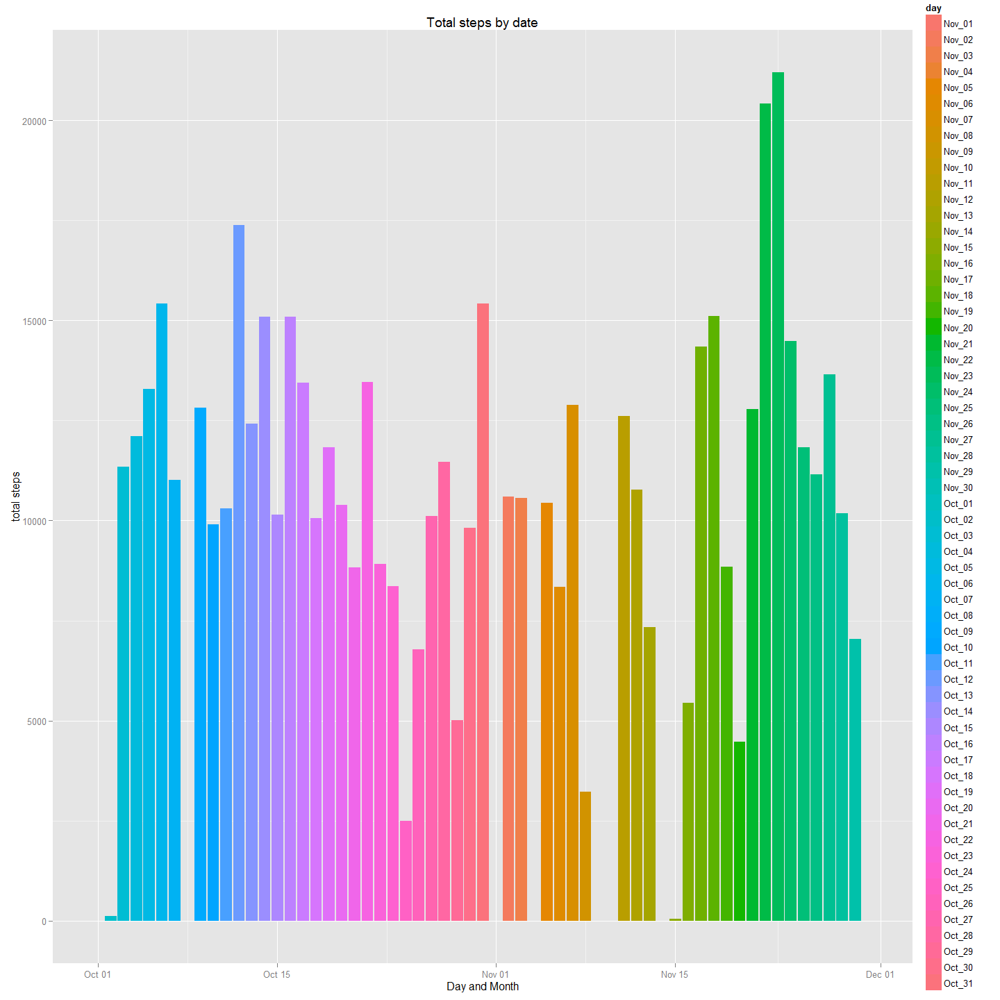
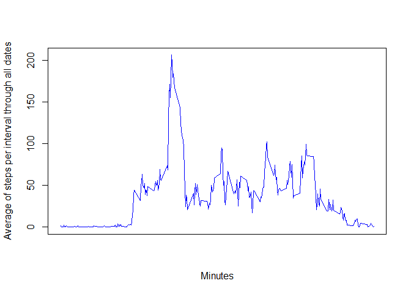
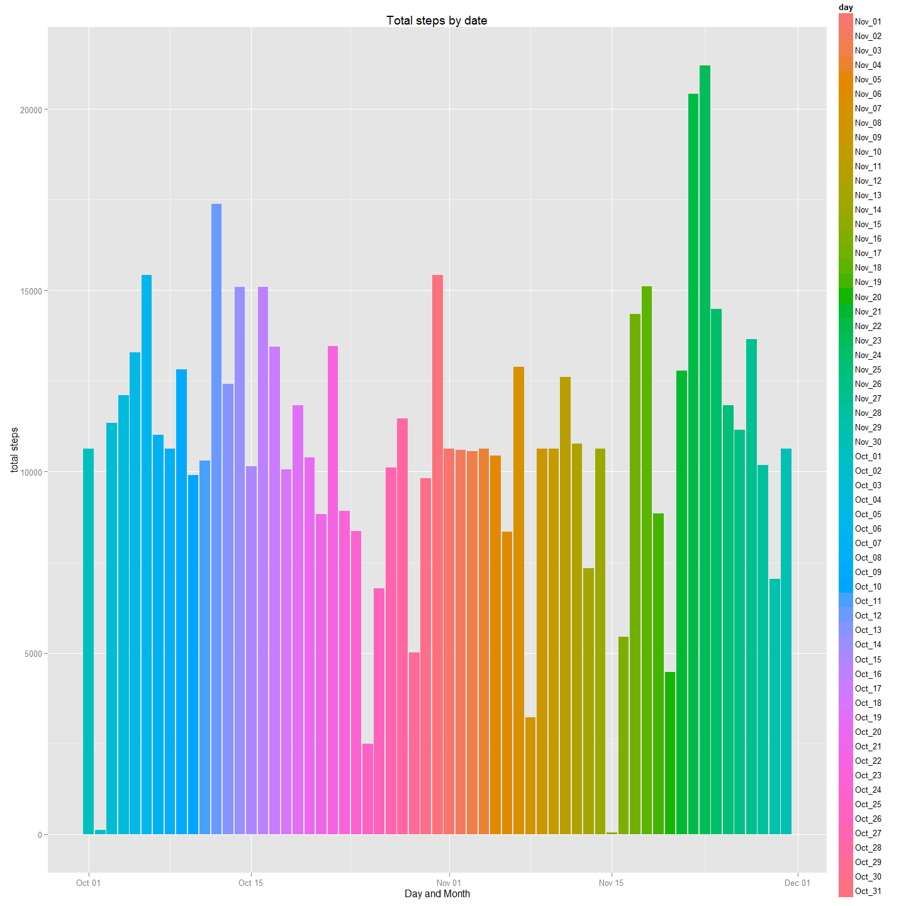
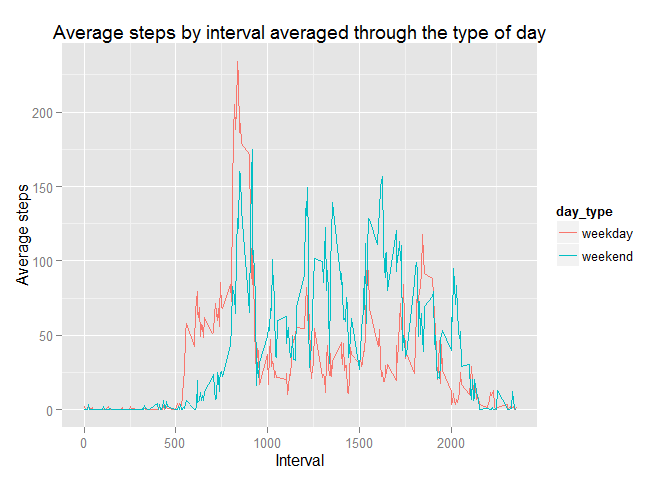

# Reproducible Research: Peer Assessment 1
Karla Muñoz-Esquivel (modified by)  
Sunday, March 15, 2015  


## Loading and preprocessing the data

```r
setwd(".")
activity_file <- file.path(getwd(), "activity", "activity.csv")
activity_data <- read.csv(activity_file, header = TRUE, sep = ",", quote = "\"",dec = ".", fill = TRUE, stringsAsFactors = FALSE)
print(head(activity_data))
```

```
##   steps       date interval
## 1    NA 2012-10-01        0
## 2    NA 2012-10-01        5
## 3    NA 2012-10-01       10
## 4    NA 2012-10-01       15
## 5    NA 2012-10-01       20
## 6    NA 2012-10-01       25
```
### Visualising some descriptives of the data

```r
print(summary(activity_data))
```

```
##      steps            date              interval     
##  Min.   :  0.00   Length:17568       Min.   :   0.0  
##  1st Qu.:  0.00   Class :character   1st Qu.: 588.8  
##  Median :  0.00   Mode  :character   Median :1177.5  
##  Mean   : 37.38                      Mean   :1177.5  
##  3rd Qu.: 12.00                      3rd Qu.:1766.2  
##  Max.   :806.00                      Max.   :2355.0  
##  NA's   :2304
```

```r
str(activity_data)
```

```
## 'data.frame':	17568 obs. of  3 variables:
##  $ steps   : int  NA NA NA NA NA NA NA NA NA NA ...
##  $ date    : chr  "2012-10-01" "2012-10-01" "2012-10-01" "2012-10-01" ...
##  $ interval: int  0 5 10 15 20 25 30 35 40 45 ...
```
### Formatting data: casting data as date

```r
library(dplyr)
activity_data <- mutate(activity_data, 
                        date = as.Date(date, format = "%Y-%m-%d"),
                        day = as.character(format(date,format="%b_%d")))
str(activity_data)
```

```
## 'data.frame':	17568 obs. of  4 variables:
##  $ steps   : int  NA NA NA NA NA NA NA NA NA NA ...
##  $ date    : Date, format: "2012-10-01" "2012-10-01" ...
##  $ interval: int  0 5 10 15 20 25 30 35 40 45 ...
##  $ day     : chr  "Oct_01" "Oct_01" "Oct_01" "Oct_01" ...
```

###Group data by date to obtain the number of steps per day

```r
library(dplyr)
```

```
## 
## Attaching package: 'dplyr'
## 
## The following object is masked from 'package:stats':
## 
##     filter
## 
## The following objects are masked from 'package:base':
## 
##     intersect, setdiff, setequal, union
```

```r
data_sum <- summarise(group_by(arrange(activity_data, date)
                                                , date, day)
                     ,Total_Steps=sum(steps, na.rm=TRUE)                     
                     )
```

## What is mean total number of steps taken per day?

1. Make a histogram of the total number of steps taken each day


```r
library(ggplot2)
library(scales)
p1<- qplot(x=date, y=Total_Steps, fill=day,
                      data=data_sum, geom="bar", stat="identity",
                      position="dodge", 
                      xlab="Day and Month", 
                      ylab="total steps", 
                      main="Total steps by date")
print(p1)
```

 

2. Calculate and report the mean and median total number of steps taken per day

```r
library(dplyr)
library(xtable)
```

```
## Warning: package 'xtable' was built under R version 3.1.3
```

```r
data_sum <- summarise(group_by(arrange(activity_data, date)
                                                ,day)
                     ,Mean_Steps_per_day = mean(steps, na.rm=TRUE)
                     ,Median_Steps_per_day = median(steps, na.rm = TRUE)
                     )
xt <- xtable(data_sum)
print(xt, type="html")
```

<!-- html table generated in R 3.1.2 by xtable 1.7-4 package -->
<!-- Sun Mar 15 20:23:43 2015 -->
<table border=1>
<tr> <th>  </th> <th> day </th> <th> Mean_Steps_per_day </th> <th> Median_Steps_per_day </th>  </tr>
  <tr> <td align="right"> 1 </td> <td> Nov_01 </td> <td align="right">  </td> <td align="right">  </td> </tr>
  <tr> <td align="right"> 2 </td> <td> Nov_02 </td> <td align="right"> 36.81 </td> <td align="right"> 0.00 </td> </tr>
  <tr> <td align="right"> 3 </td> <td> Nov_03 </td> <td align="right"> 36.70 </td> <td align="right"> 0.00 </td> </tr>
  <tr> <td align="right"> 4 </td> <td> Nov_04 </td> <td align="right">  </td> <td align="right">  </td> </tr>
  <tr> <td align="right"> 5 </td> <td> Nov_05 </td> <td align="right"> 36.25 </td> <td align="right"> 0.00 </td> </tr>
  <tr> <td align="right"> 6 </td> <td> Nov_06 </td> <td align="right"> 28.94 </td> <td align="right"> 0.00 </td> </tr>
  <tr> <td align="right"> 7 </td> <td> Nov_07 </td> <td align="right"> 44.73 </td> <td align="right"> 0.00 </td> </tr>
  <tr> <td align="right"> 8 </td> <td> Nov_08 </td> <td align="right"> 11.18 </td> <td align="right"> 0.00 </td> </tr>
  <tr> <td align="right"> 9 </td> <td> Nov_09 </td> <td align="right">  </td> <td align="right">  </td> </tr>
  <tr> <td align="right"> 10 </td> <td> Nov_10 </td> <td align="right">  </td> <td align="right">  </td> </tr>
  <tr> <td align="right"> 11 </td> <td> Nov_11 </td> <td align="right"> 43.78 </td> <td align="right"> 0.00 </td> </tr>
  <tr> <td align="right"> 12 </td> <td> Nov_12 </td> <td align="right"> 37.38 </td> <td align="right"> 0.00 </td> </tr>
  <tr> <td align="right"> 13 </td> <td> Nov_13 </td> <td align="right"> 25.47 </td> <td align="right"> 0.00 </td> </tr>
  <tr> <td align="right"> 14 </td> <td> Nov_14 </td> <td align="right">  </td> <td align="right">  </td> </tr>
  <tr> <td align="right"> 15 </td> <td> Nov_15 </td> <td align="right"> 0.14 </td> <td align="right"> 0.00 </td> </tr>
  <tr> <td align="right"> 16 </td> <td> Nov_16 </td> <td align="right"> 18.89 </td> <td align="right"> 0.00 </td> </tr>
  <tr> <td align="right"> 17 </td> <td> Nov_17 </td> <td align="right"> 49.79 </td> <td align="right"> 0.00 </td> </tr>
  <tr> <td align="right"> 18 </td> <td> Nov_18 </td> <td align="right"> 52.47 </td> <td align="right"> 0.00 </td> </tr>
  <tr> <td align="right"> 19 </td> <td> Nov_19 </td> <td align="right"> 30.70 </td> <td align="right"> 0.00 </td> </tr>
  <tr> <td align="right"> 20 </td> <td> Nov_20 </td> <td align="right"> 15.53 </td> <td align="right"> 0.00 </td> </tr>
  <tr> <td align="right"> 21 </td> <td> Nov_21 </td> <td align="right"> 44.40 </td> <td align="right"> 0.00 </td> </tr>
  <tr> <td align="right"> 22 </td> <td> Nov_22 </td> <td align="right"> 70.93 </td> <td align="right"> 0.00 </td> </tr>
  <tr> <td align="right"> 23 </td> <td> Nov_23 </td> <td align="right"> 73.59 </td> <td align="right"> 0.00 </td> </tr>
  <tr> <td align="right"> 24 </td> <td> Nov_24 </td> <td align="right"> 50.27 </td> <td align="right"> 0.00 </td> </tr>
  <tr> <td align="right"> 25 </td> <td> Nov_25 </td> <td align="right"> 41.09 </td> <td align="right"> 0.00 </td> </tr>
  <tr> <td align="right"> 26 </td> <td> Nov_26 </td> <td align="right"> 38.76 </td> <td align="right"> 0.00 </td> </tr>
  <tr> <td align="right"> 27 </td> <td> Nov_27 </td> <td align="right"> 47.38 </td> <td align="right"> 0.00 </td> </tr>
  <tr> <td align="right"> 28 </td> <td> Nov_28 </td> <td align="right"> 35.36 </td> <td align="right"> 0.00 </td> </tr>
  <tr> <td align="right"> 29 </td> <td> Nov_29 </td> <td align="right"> 24.47 </td> <td align="right"> 0.00 </td> </tr>
  <tr> <td align="right"> 30 </td> <td> Nov_30 </td> <td align="right">  </td> <td align="right">  </td> </tr>
  <tr> <td align="right"> 31 </td> <td> Oct_01 </td> <td align="right">  </td> <td align="right">  </td> </tr>
  <tr> <td align="right"> 32 </td> <td> Oct_02 </td> <td align="right"> 0.44 </td> <td align="right"> 0.00 </td> </tr>
  <tr> <td align="right"> 33 </td> <td> Oct_03 </td> <td align="right"> 39.42 </td> <td align="right"> 0.00 </td> </tr>
  <tr> <td align="right"> 34 </td> <td> Oct_04 </td> <td align="right"> 42.07 </td> <td align="right"> 0.00 </td> </tr>
  <tr> <td align="right"> 35 </td> <td> Oct_05 </td> <td align="right"> 46.16 </td> <td align="right"> 0.00 </td> </tr>
  <tr> <td align="right"> 36 </td> <td> Oct_06 </td> <td align="right"> 53.54 </td> <td align="right"> 0.00 </td> </tr>
  <tr> <td align="right"> 37 </td> <td> Oct_07 </td> <td align="right"> 38.25 </td> <td align="right"> 0.00 </td> </tr>
  <tr> <td align="right"> 38 </td> <td> Oct_08 </td> <td align="right">  </td> <td align="right">  </td> </tr>
  <tr> <td align="right"> 39 </td> <td> Oct_09 </td> <td align="right"> 44.48 </td> <td align="right"> 0.00 </td> </tr>
  <tr> <td align="right"> 40 </td> <td> Oct_10 </td> <td align="right"> 34.38 </td> <td align="right"> 0.00 </td> </tr>
  <tr> <td align="right"> 41 </td> <td> Oct_11 </td> <td align="right"> 35.78 </td> <td align="right"> 0.00 </td> </tr>
  <tr> <td align="right"> 42 </td> <td> Oct_12 </td> <td align="right"> 60.35 </td> <td align="right"> 0.00 </td> </tr>
  <tr> <td align="right"> 43 </td> <td> Oct_13 </td> <td align="right"> 43.15 </td> <td align="right"> 0.00 </td> </tr>
  <tr> <td align="right"> 44 </td> <td> Oct_14 </td> <td align="right"> 52.42 </td> <td align="right"> 0.00 </td> </tr>
  <tr> <td align="right"> 45 </td> <td> Oct_15 </td> <td align="right"> 35.20 </td> <td align="right"> 0.00 </td> </tr>
  <tr> <td align="right"> 46 </td> <td> Oct_16 </td> <td align="right"> 52.38 </td> <td align="right"> 0.00 </td> </tr>
  <tr> <td align="right"> 47 </td> <td> Oct_17 </td> <td align="right"> 46.71 </td> <td align="right"> 0.00 </td> </tr>
  <tr> <td align="right"> 48 </td> <td> Oct_18 </td> <td align="right"> 34.92 </td> <td align="right"> 0.00 </td> </tr>
  <tr> <td align="right"> 49 </td> <td> Oct_19 </td> <td align="right"> 41.07 </td> <td align="right"> 0.00 </td> </tr>
  <tr> <td align="right"> 50 </td> <td> Oct_20 </td> <td align="right"> 36.09 </td> <td align="right"> 0.00 </td> </tr>
  <tr> <td align="right"> 51 </td> <td> Oct_21 </td> <td align="right"> 30.63 </td> <td align="right"> 0.00 </td> </tr>
  <tr> <td align="right"> 52 </td> <td> Oct_22 </td> <td align="right"> 46.74 </td> <td align="right"> 0.00 </td> </tr>
  <tr> <td align="right"> 53 </td> <td> Oct_23 </td> <td align="right"> 30.97 </td> <td align="right"> 0.00 </td> </tr>
  <tr> <td align="right"> 54 </td> <td> Oct_24 </td> <td align="right"> 29.01 </td> <td align="right"> 0.00 </td> </tr>
  <tr> <td align="right"> 55 </td> <td> Oct_25 </td> <td align="right"> 8.65 </td> <td align="right"> 0.00 </td> </tr>
  <tr> <td align="right"> 56 </td> <td> Oct_26 </td> <td align="right"> 23.53 </td> <td align="right"> 0.00 </td> </tr>
  <tr> <td align="right"> 57 </td> <td> Oct_27 </td> <td align="right"> 35.14 </td> <td align="right"> 0.00 </td> </tr>
  <tr> <td align="right"> 58 </td> <td> Oct_28 </td> <td align="right"> 39.78 </td> <td align="right"> 0.00 </td> </tr>
  <tr> <td align="right"> 59 </td> <td> Oct_29 </td> <td align="right"> 17.42 </td> <td align="right"> 0.00 </td> </tr>
  <tr> <td align="right"> 60 </td> <td> Oct_30 </td> <td align="right"> 34.09 </td> <td align="right"> 0.00 </td> </tr>
  <tr> <td align="right"> 61 </td> <td> Oct_31 </td> <td align="right"> 53.52 </td> <td align="right"> 0.00 </td> </tr>
   </table>

## What is the average daily activity pattern?

1. Make a time series plot (i.e. type = "l") of the 5-minute interval (x-axis) and the average number of steps taken, averaged across all days (y-axis)

```r
data_sum2 <- summarise(group_by(arrange(activity_data, date)
                                         ,interval)
                     ,Average_Steps=mean(steps, na.rm=TRUE)
                     )

plot(data_sum2$Average_Steps ~ data_sum2$interval, data_sum2, xaxt = "n", type='l', col="blue", ylab="Average of steps per interval through all dates", xlab= "Minutes")
```

 

2. Which 5-minute interval, on average across all the days in the dataset, contains the maximum number of steps?

```r
library(data.table)
```

```
## 
## Attaching package: 'data.table'
## 
## The following objects are masked from 'package:dplyr':
## 
##     between, last
```

```r
data_sum2 <- data.table(data_sum2)
print(data_sum2[which.max(Average_Steps)])
```

```
##    interval Average_Steps
## 1:      835      206.1698
```


## Imputing missing values

1.  Calculate and report the total number of missing values in the dataset (i.e. the total number of rows with NAs)

```r
library(data.table)
activity_data = data.table(activity_data)
data_with_NAs = activity_data[,is.na(activity_data)]
total_num_NAs <- length(data_with_NAs[data_with_NAs == TRUE])
print(total_num_NAs)
```

```
## [1] 2304
```
**The total number of rows with NAs is: 2304**

2.  Devise a strategy for filling in all of the missing values in the dataset. The strategy does not need to be sophisticated. For example, you could use the mean/median for that day, or the mean for that 5-minute interval, etc.

**In this case, the strategy chosen is missing values are substituted by the average of the interval across all dates, converted to the nearest int by truncation**

3.   Create a new dataset that is equal to the original dataset but with the missing data filled in.

```r
        library(data.table)
        activity_data_updated <- data.table(activity_data)
        dimensions <- dim(activity_data_updated)
 
        for (i in 1: dimensions[1])
                {
                        if(is.na(activity_data_updated[i][1]$steps))
                        {
                                retrieved_row <- data_sum2[which(interval==activity_data_updated[i][1]$interval)]
                                activity_data_updated[i][1]$steps <- trunc(retrieved_row$Average_Steps)
                        }
                             
                }
        print(summary(activity_data_updated))
```

```
##      steps             date               interval          day           
##  Min.   :  0.00   Min.   :2012-10-01   Min.   :   0.0   Length:17568      
##  1st Qu.:  0.00   1st Qu.:2012-10-16   1st Qu.: 588.8   Class :character  
##  Median :  0.00   Median :2012-10-31   Median :1177.5   Mode  :character  
##  Mean   : 37.33   Mean   :2012-10-31   Mean   :1177.5                     
##  3rd Qu.: 27.00   3rd Qu.:2012-11-15   3rd Qu.:1766.2                     
##  Max.   :806.00   Max.   :2012-11-30   Max.   :2355.0
```

4.    Make a histogram of the total number of steps taken each day and Calculate and report the mean and median total number of steps taken per day. Do these values differ from the estimates from the first part of the assignment? What is the impact of imputing missing data on the estimates of the total daily number of steps?

###Group data by date to obtain the number of steps per day without missing values

```r
library(dplyr)
data_sum3 <- summarise(group_by(arrange(activity_data_updated, date)
                                                , date, day)
                     ,Total_Steps=sum(steps, na.rm=TRUE)                     
                     )
```


```r
library(ggplot2)
library(scales)
p1<- qplot(x=date, y=Total_Steps, fill=day,
                      data=data_sum3, geom="bar", stat="identity",
                      position="dodge", 
                      xlab="Day and Month", 
                      ylab="total steps", 
                      main="Total steps by date")
print(p1)
```

 


```r
library(dplyr)
library(xtable)

data_sum3 <- summarise(group_by(arrange(activity_data_updated, date)
                                                ,day)
                     ,Mean_Steps_per_day = mean(steps, na.rm=TRUE)
                     ,Median_Steps_per_day = median(steps, na.rm = TRUE)
                     )
xt <- xtable(data_sum3)
print(xt, type="html")
```

<!-- html table generated in R 3.1.2 by xtable 1.7-4 package -->
<!-- Sun Mar 15 21:36:00 2015 -->
<table border=1>
<tr> <th>  </th> <th> day </th> <th> Mean_Steps_per_day </th> <th> Median_Steps_per_day </th>  </tr>
  <tr> <td align="right"> 1 </td> <td> Oct_01 </td> <td align="right"> 36.95 </td> <td align="right"> 33.50 </td> </tr>
  <tr> <td align="right"> 2 </td> <td> Oct_02 </td> <td align="right"> 0.44 </td> <td align="right"> 0.00 </td> </tr>
  <tr> <td align="right"> 3 </td> <td> Oct_03 </td> <td align="right"> 39.42 </td> <td align="right"> 0.00 </td> </tr>
  <tr> <td align="right"> 4 </td> <td> Oct_04 </td> <td align="right"> 42.07 </td> <td align="right"> 0.00 </td> </tr>
  <tr> <td align="right"> 5 </td> <td> Oct_05 </td> <td align="right"> 46.16 </td> <td align="right"> 0.00 </td> </tr>
  <tr> <td align="right"> 6 </td> <td> Oct_06 </td> <td align="right"> 53.54 </td> <td align="right"> 0.00 </td> </tr>
  <tr> <td align="right"> 7 </td> <td> Oct_07 </td> <td align="right"> 38.25 </td> <td align="right"> 0.00 </td> </tr>
  <tr> <td align="right"> 8 </td> <td> Oct_08 </td> <td align="right"> 36.95 </td> <td align="right"> 33.50 </td> </tr>
  <tr> <td align="right"> 9 </td> <td> Oct_09 </td> <td align="right"> 44.48 </td> <td align="right"> 0.00 </td> </tr>
  <tr> <td align="right"> 10 </td> <td> Oct_10 </td> <td align="right"> 34.38 </td> <td align="right"> 0.00 </td> </tr>
  <tr> <td align="right"> 11 </td> <td> Oct_11 </td> <td align="right"> 35.78 </td> <td align="right"> 0.00 </td> </tr>
  <tr> <td align="right"> 12 </td> <td> Oct_12 </td> <td align="right"> 60.35 </td> <td align="right"> 0.00 </td> </tr>
  <tr> <td align="right"> 13 </td> <td> Oct_13 </td> <td align="right"> 43.15 </td> <td align="right"> 0.00 </td> </tr>
  <tr> <td align="right"> 14 </td> <td> Oct_14 </td> <td align="right"> 52.42 </td> <td align="right"> 0.00 </td> </tr>
  <tr> <td align="right"> 15 </td> <td> Oct_15 </td> <td align="right"> 35.20 </td> <td align="right"> 0.00 </td> </tr>
  <tr> <td align="right"> 16 </td> <td> Oct_16 </td> <td align="right"> 52.38 </td> <td align="right"> 0.00 </td> </tr>
  <tr> <td align="right"> 17 </td> <td> Oct_17 </td> <td align="right"> 46.71 </td> <td align="right"> 0.00 </td> </tr>
  <tr> <td align="right"> 18 </td> <td> Oct_18 </td> <td align="right"> 34.92 </td> <td align="right"> 0.00 </td> </tr>
  <tr> <td align="right"> 19 </td> <td> Oct_19 </td> <td align="right"> 41.07 </td> <td align="right"> 0.00 </td> </tr>
  <tr> <td align="right"> 20 </td> <td> Oct_20 </td> <td align="right"> 36.09 </td> <td align="right"> 0.00 </td> </tr>
  <tr> <td align="right"> 21 </td> <td> Oct_21 </td> <td align="right"> 30.63 </td> <td align="right"> 0.00 </td> </tr>
  <tr> <td align="right"> 22 </td> <td> Oct_22 </td> <td align="right"> 46.74 </td> <td align="right"> 0.00 </td> </tr>
  <tr> <td align="right"> 23 </td> <td> Oct_23 </td> <td align="right"> 30.97 </td> <td align="right"> 0.00 </td> </tr>
  <tr> <td align="right"> 24 </td> <td> Oct_24 </td> <td align="right"> 29.01 </td> <td align="right"> 0.00 </td> </tr>
  <tr> <td align="right"> 25 </td> <td> Oct_25 </td> <td align="right"> 8.65 </td> <td align="right"> 0.00 </td> </tr>
  <tr> <td align="right"> 26 </td> <td> Oct_26 </td> <td align="right"> 23.53 </td> <td align="right"> 0.00 </td> </tr>
  <tr> <td align="right"> 27 </td> <td> Oct_27 </td> <td align="right"> 35.14 </td> <td align="right"> 0.00 </td> </tr>
  <tr> <td align="right"> 28 </td> <td> Oct_28 </td> <td align="right"> 39.78 </td> <td align="right"> 0.00 </td> </tr>
  <tr> <td align="right"> 29 </td> <td> Oct_29 </td> <td align="right"> 17.42 </td> <td align="right"> 0.00 </td> </tr>
  <tr> <td align="right"> 30 </td> <td> Oct_30 </td> <td align="right"> 34.09 </td> <td align="right"> 0.00 </td> </tr>
  <tr> <td align="right"> 31 </td> <td> Oct_31 </td> <td align="right"> 53.52 </td> <td align="right"> 0.00 </td> </tr>
  <tr> <td align="right"> 32 </td> <td> Nov_01 </td> <td align="right"> 36.95 </td> <td align="right"> 33.50 </td> </tr>
  <tr> <td align="right"> 33 </td> <td> Nov_02 </td> <td align="right"> 36.81 </td> <td align="right"> 0.00 </td> </tr>
  <tr> <td align="right"> 34 </td> <td> Nov_03 </td> <td align="right"> 36.70 </td> <td align="right"> 0.00 </td> </tr>
  <tr> <td align="right"> 35 </td> <td> Nov_04 </td> <td align="right"> 36.95 </td> <td align="right"> 33.50 </td> </tr>
  <tr> <td align="right"> 36 </td> <td> Nov_05 </td> <td align="right"> 36.25 </td> <td align="right"> 0.00 </td> </tr>
  <tr> <td align="right"> 37 </td> <td> Nov_06 </td> <td align="right"> 28.94 </td> <td align="right"> 0.00 </td> </tr>
  <tr> <td align="right"> 38 </td> <td> Nov_07 </td> <td align="right"> 44.73 </td> <td align="right"> 0.00 </td> </tr>
  <tr> <td align="right"> 39 </td> <td> Nov_08 </td> <td align="right"> 11.18 </td> <td align="right"> 0.00 </td> </tr>
  <tr> <td align="right"> 40 </td> <td> Nov_09 </td> <td align="right"> 36.95 </td> <td align="right"> 33.50 </td> </tr>
  <tr> <td align="right"> 41 </td> <td> Nov_10 </td> <td align="right"> 36.95 </td> <td align="right"> 33.50 </td> </tr>
  <tr> <td align="right"> 42 </td> <td> Nov_11 </td> <td align="right"> 43.78 </td> <td align="right"> 0.00 </td> </tr>
  <tr> <td align="right"> 43 </td> <td> Nov_12 </td> <td align="right"> 37.38 </td> <td align="right"> 0.00 </td> </tr>
  <tr> <td align="right"> 44 </td> <td> Nov_13 </td> <td align="right"> 25.47 </td> <td align="right"> 0.00 </td> </tr>
  <tr> <td align="right"> 45 </td> <td> Nov_14 </td> <td align="right"> 36.95 </td> <td align="right"> 33.50 </td> </tr>
  <tr> <td align="right"> 46 </td> <td> Nov_15 </td> <td align="right"> 0.14 </td> <td align="right"> 0.00 </td> </tr>
  <tr> <td align="right"> 47 </td> <td> Nov_16 </td> <td align="right"> 18.89 </td> <td align="right"> 0.00 </td> </tr>
  <tr> <td align="right"> 48 </td> <td> Nov_17 </td> <td align="right"> 49.79 </td> <td align="right"> 0.00 </td> </tr>
  <tr> <td align="right"> 49 </td> <td> Nov_18 </td> <td align="right"> 52.47 </td> <td align="right"> 0.00 </td> </tr>
  <tr> <td align="right"> 50 </td> <td> Nov_19 </td> <td align="right"> 30.70 </td> <td align="right"> 0.00 </td> </tr>
  <tr> <td align="right"> 51 </td> <td> Nov_20 </td> <td align="right"> 15.53 </td> <td align="right"> 0.00 </td> </tr>
  <tr> <td align="right"> 52 </td> <td> Nov_21 </td> <td align="right"> 44.40 </td> <td align="right"> 0.00 </td> </tr>
  <tr> <td align="right"> 53 </td> <td> Nov_22 </td> <td align="right"> 70.93 </td> <td align="right"> 0.00 </td> </tr>
  <tr> <td align="right"> 54 </td> <td> Nov_23 </td> <td align="right"> 73.59 </td> <td align="right"> 0.00 </td> </tr>
  <tr> <td align="right"> 55 </td> <td> Nov_24 </td> <td align="right"> 50.27 </td> <td align="right"> 0.00 </td> </tr>
  <tr> <td align="right"> 56 </td> <td> Nov_25 </td> <td align="right"> 41.09 </td> <td align="right"> 0.00 </td> </tr>
  <tr> <td align="right"> 57 </td> <td> Nov_26 </td> <td align="right"> 38.76 </td> <td align="right"> 0.00 </td> </tr>
  <tr> <td align="right"> 58 </td> <td> Nov_27 </td> <td align="right"> 47.38 </td> <td align="right"> 0.00 </td> </tr>
  <tr> <td align="right"> 59 </td> <td> Nov_28 </td> <td align="right"> 35.36 </td> <td align="right"> 0.00 </td> </tr>
  <tr> <td align="right"> 60 </td> <td> Nov_29 </td> <td align="right"> 24.47 </td> <td align="right"> 0.00 </td> </tr>
  <tr> <td align="right"> 61 </td> <td> Nov_30 </td> <td align="right"> 36.95 </td> <td align="right"> 33.50 </td> </tr>
   </table>

**Yes, there is a difference on these values obtained when compared with the ones obtained with the data that includes missing values**

**The impact seems small**


## Are there differences in activity patterns between weekdays and weekends?

1. Create a new factor variable in the dataset with two levels -- "weekday" and "weekend" indicating whether a given date is a weekday or weekend day.


```r
  is_weekday <- function(date_val)
          {
                if(weekdays(date_val) == "Saturday" || weekdays(date_val) == "Sunday")
                {
                 c("weekend")
                }
                else
                {
                 c("weekday")                        
                }
                
          }
```


```r
 library(dplyr)
 day_type <- character(dim(activity_data)[1])
 
 for(i in 1:dim(activity_data)[1])
         {
           day_type[i] <- is_weekday(activity_data_updated$date[i])
         }
 activity_data = mutate(activity_data, day_type = as.factor(day_type))

 print(str(activity_data))
```

```
## Classes 'data.table' and 'data.frame':	17568 obs. of  5 variables:
##  $ steps   : int  NA NA NA NA NA NA NA NA NA NA ...
##  $ date    : Date, format: "2012-10-01" "2012-10-01" ...
##  $ interval: int  0 5 10 15 20 25 30 35 40 45 ...
##  $ day     : chr  "Oct_01" "Oct_01" "Oct_01" "Oct_01" ...
##  $ day_type: Factor w/ 2 levels "weekday","weekend": 1 1 1 1 1 1 1 1 1 1 ...
##  - attr(*, ".internal.selfref")=<externalptr> 
## NULL
```

```r
 print(summary(activity_data))
```

```
##      steps             date               interval          day           
##  Min.   :  0.00   Min.   :2012-10-01   Min.   :   0.0   Length:17568      
##  1st Qu.:  0.00   1st Qu.:2012-10-16   1st Qu.: 588.8   Class :character  
##  Median :  0.00   Median :2012-10-31   Median :1177.5   Mode  :character  
##  Mean   : 37.38   Mean   :2012-10-31   Mean   :1177.5                     
##  3rd Qu.: 12.00   3rd Qu.:2012-11-15   3rd Qu.:1766.2                     
##  Max.   :806.00   Max.   :2012-11-30   Max.   :2355.0                     
##  NA's   :2304                                                             
##     day_type    
##  weekday:12960  
##  weekend: 4608  
##                 
##                 
##                 
##                 
## 
```

2. Make a panel plot containing a time series plot (i.e. type = "l") of the 5-minute interval (x-axis) and the average number of steps taken, averaged across all weekday days or weekend days (y-axis). 


```r
data_sum5 <- summarise(group_by(arrange(activity_data, date)
                                         ,interval, day_type)
                     ,Average_Steps=mean(steps, na.rm=TRUE)
                     )
print(data_sum5)
```

```
## Source: local data table [576 x 3]
## Groups: interval
## 
##    interval day_type Average_Steps
## 1         0  weekday     2.3333333
## 2         5  weekday     0.4615385
## 3        10  weekday     0.1794872
## 4        15  weekday     0.2051282
## 5        20  weekday     0.1025641
## 6        25  weekday     1.5128205
## 7        30  weekday     0.7179487
## 8        35  weekday     1.1794872
## 9        40  weekday     0.0000000
## 10       45  weekday     1.8461538
## ..      ...      ...           ...
```

```r
library(ggplot2)
library(scales)
p2<- qplot(x=interval, y=Average_Steps, colour=day_type,
                      data=data_sum5, geom="line", stat="identity",
                      position="dodge", 
                      xlab="Interval", 
                      ylab="Average steps", 
                      main="Average steps by interval averaged through the type of day")
print(p2)
```

```
## ymax not defined: adjusting position using y instead
```

 
